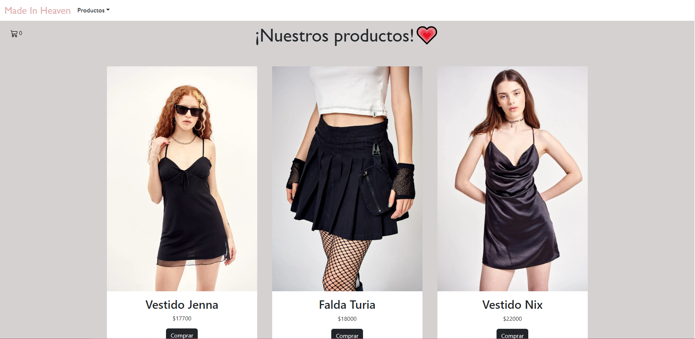

# Proyecto Final ReactJs CODERHOUSE 

Esta página es una simulación de un ecommerce de una tienda de indumentaria femenina.

## Descripción

Para empezar, soy una jóven de 17 años la cual está emocionada de terminar un curso tan enriquecedor que me dio ganas de aprender más sobre el mundo de la programación. Mi principal objetivo al realizar esta página fue que pueda terminar de aprender los conceptos vistos en el curso de ReactJs en CoderHouse, priorizando la funcionalidad de la página antes que el diseño, ya que intuyo que voy a preferir el área del BackEnd.

## Este proyecto fue realizado con:
- Bootstrap
- ReactJs

## Para inicializar el proyecto necesitaras:
### `npm start`
Instalar paquetes npm:

### `npm install`
